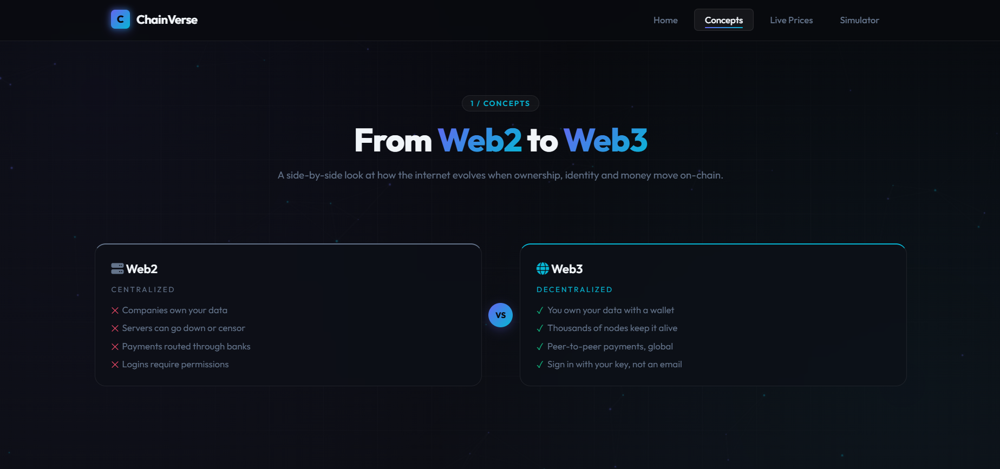

# ChainVerse — Web3 Explorer

> A premium 4-page dark-futuristic learning hub for **Blockchain and Web3**.

ChainVerse is a single, cohesive static-site project that takes a beginner from "what is a block?" to actually mining one in their browser using real SHA-256 proof-of-work. The UI is fully animated: glassmorphism cards, particle background grid, gradient text, hover glow, Intersection-Observer scroll reveals, keyframe hero animations and live number counters.

---

## Pages

| # | File | What it does |
|---|------|--------------|
| 1 | `index.html` | Landing / Home. Hero with floating animated chain of glowing blocks, "What is Blockchain?", animated stats (100% Decentralized, 0 Central Authority, 100% Trustless), Key Pillars cards, "Why It Matters" highlight, footer. |
| 2 | `concepts.html` | Web3 Concepts. Side-by-side **Web2 vs Web3**, full **Ethereum vs Bitcoin** comparison table, **Public Key vs Private Key** diagram, **Blockchain vs Traditional DB** side-by-side, plus 3 interactive **flip cards**. Scroll-triggered fade-ins. |
| 3 | `prices.html` | Live Crypto Prices from the **CoinGecko public API**. BTC, ETH, SOL, MATIC in glassmorphism cards with logos, USD price (animated counter), 24-hour change with green/red arrow, skeleton loading, refresh button with spinning loader, last-updated timestamp, auto-refresh every 60 s, graceful error state. |
| 4 | `simulator.html` | Interactive **Block Mining Simulator** using `crypto.subtle.digest('SHA-256', …)`. Two chained blocks. Mine each until hash starts with `"00"`. Typewriter hash reveal, live nonce counter, broken-chain flash + shake when Block #1 data is edited after mining. |

---

## File structure

```
/project
├── index.html         # Page 1 — Home / Landing
├── concepts.html      # Page 2 — Web3 Concepts
├── prices.html        # Page 3 — Live Prices dashboard
├── simulator.html     # Page 4 — Block Mining Simulator
├── style.css          # Shared global styles (glass, nav, hero, particles, animations)
├── nav.js             # Shared navbar, active-link detection, particle canvas,
│                      # Intersection-Observer fade-ins, click ripple, number counter helper.
├── prices.js          # CoinGecko API fetch, skeleton -> real card render, animated counters.
├── simulator.js       # Web Crypto SHA-256 mining loop, typewriter hash, chain invalidation.
└── README.md          # This file.
```

---

## How to run locally

No build-step, no dependency install.

```bash
# from the project folder
python3 -m http.server 8000
# then open http://localhost:8000
```

Or simply **double-click `index.html`** — every page works as a plain `file://` open in any modern browser.

The Live Prices page requires internet access (CoinGecko public API) and works cross-origin with no API key.

---

## Design system

- **Fonts:** Space Grotesk (headings / numbers) · Inter (body) · JetBrains Mono (hashes / nonce) — all Google Fonts.
- **Palette:** Dark navy/black background `#05060d → #0a0d1a`, violet `#8a5cff`, cyan `#21e6ff`, pink accent `#ff4dd2`, success green `#2ee59d`, danger red `#ff4d6d`.
- **Glassmorphism:** `.glass` class — `backdrop-filter: blur(18px) saturate(140%)` with gradient-border overlay.
- **Particles:** Shared `<canvas id="particles">` rendered once per page by `nav.js` (~90 nodes on desktop, 40 on mobile, animated drifting with proximity lines).
- **Background grid:** CSS-only diagonal grid with a radial mask and slow float.
- **Active nav:** detected in `nav.js` by comparing `location.pathname` to `data-page` attributes.
- **Animations:** `IntersectionObserver` adds the `in` class to `.reveal` elements; CSS keyframes drive hero float, gradient shift, pulse, shake, broken-chain flash, mining pulse.

---

## Animations checklist (applied globally)

✅ CSS keyframe animations for hero block chain, gradient text, status pulse, ripple
✅ Scroll-triggered fade/slide-in (Intersection Observer)
✅ Hover scale, glow, color shift on cards & buttons
✅ Glassmorphism via `backdrop-filter`
✅ Gradient animated backgrounds + particle canvas
✅ Button click ripple effect
✅ Smooth loading → error → success states (prices.js handles all three)

---

## Known issues & future improvements

**Known issues**
- CoinGecko free public API enforces a soft rate-limit (~10–30 calls/min). If too many visitors open the prices page at once, the API may briefly return 429 — `prices.js` displays a friendly error card and auto-retries 20 s later.
- The Web Crypto API requires a **secure context** (HTTPS, `localhost`, or `file://`). Opening `simulator.html` directly via `file://` works in all modern browsers; serving over plain HTTP from a non-localhost IP will block SHA-256.
- The mining difficulty is fixed at prefix `"00"` so demo mines complete in under a second on commodity hardware — it is intentionally NOT Bitcoin-grade difficulty.

**Future improvements**
- Sliding difficulty selector (1–4 leading zeros) with real Bitcoin difficulty curves
- Persist mined chain to `localStorage` and let users fork it (intentional re-org)
- WebSocket trading view chart on the prices page (Binance public stream)
- Multi-language i18n strings
- Dark/light-mode toggle

---

## Credits

Built with ♥ by **Ch Manoj**.
Batch: **Arbitrum Builder Labs · LamprosDAO**.

> Learn the primitives. Build the future.

---

## Website Overview

In this section, you can see a visual overview of the **ChainVerse** platform, showcasing the premium dark-futuristic UI and the interactive learning components.

### 1. Web2 vs Web3 Comparison (Concepts Page)

The **Concepts** page features a side-by-side comparison between the centralized Web2 model and the decentralized Web3 evolution. It highlights key shifts in ownership, identity, and data control using a clean, high-contrast visual layout.


