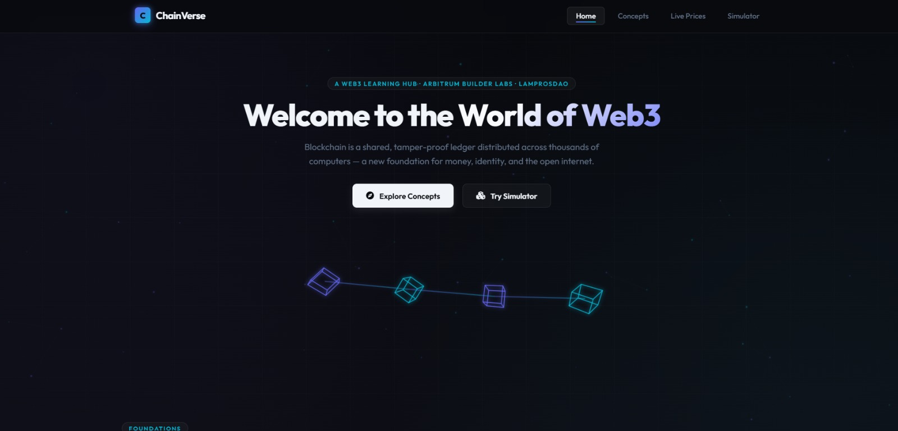
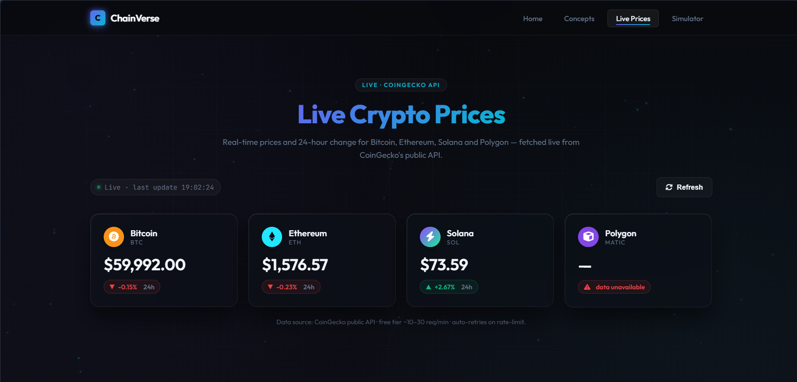
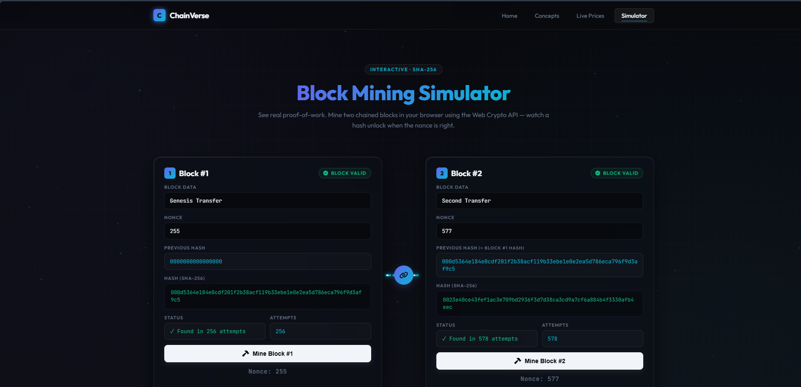

# ChainVerse — Web3 Explorer

> A premium, dark-futuristic learning hub for mastering **Blockchain and Web3** fundamentals.

ChainVerse is a comprehensive static-site project designed to guide beginners through the core concepts of blockchain technology. From understanding the basics of decentralization to actively mining blocks in the browser using real SHA-256 proof-of-work, ChainVerse provides an immersive, interactive experience.

The platform features a highly polished UI with glassmorphism, particle backgrounds, and smooth scroll-triggered animations.

---

## 🌐 Website Overview

Experience the visual journey of **ChainVerse**, showcasing its premium interface and interactive learning modules.

### 🏠 Home Page
The gateway to the Web3 world, featuring a dynamic hero section with animated blockchain visuals and an introduction to decentralized identity.


### 📚 Web3 Concepts
A deep dive into the evolution of the internet, featuring a side-by-side comparison of **Web2 vs Web3**, highlighting shifts in ownership and data control.


### 📈 Live Crypto Prices
A real-time dashboard powered by the **CoinGecko API**, displaying live price data, 24-hour trends, and market status for major cryptocurrencies.


### ⚒️ Block Mining Simulator
An interactive tool where users can experience **Proof-of-Work** firsthand. Mine blocks, adjust nonces, and see the SHA-256 hashing process in action.


---

## ✨ Key Features

- **Interactive Learning**: Hands-on blockchain simulator and conceptual comparisons.
- **Real-time Data**: Live cryptocurrency prices integrated via public APIs.
- **Modern UI/UX**: Glassmorphism, CSS keyframe animations, and particle effects.
- **Responsive Design**: Optimized for a seamless experience across all devices.
- **Performance**: Lightweight static site with no heavy dependencies.

---

## 🛠️ Tech Stack & Design

- **Frontend**: HTML5, CSS3 (Glassmorphism, Animations), JavaScript (ES6+).
- **APIs**: CoinGecko Public API for live market data.
- **Typography**: Space Grotesk (Headings), Inter (Body), JetBrains Mono (Technical data).
- **Animations**: Intersection Observer API for scroll reveals and custom CSS keyframes.

---

## 🚀 Getting Started

No installation or build steps are required. You can run ChainVerse locally in seconds:

1. **Clone the repository**:
   ```bash
   git clone https://github.com/omkumartrivedi2006-sketch/Chainverse-Web3.git
   ```
2. **Run a local server**:
   ```bash
   cd Chainverse-Web3
   python3 -m http.server 8000
   ```
3. **Access the site**: Open `http://localhost:8000` in your browser.

*Alternatively, simply open `index.html` directly in any modern web browser.*

---

## 🤝 Credits & Acknowledgments

Built with ♥ by **Om Trivedi**.
Supported by **LDRP-ITR**.

> **Learn the primitives. Build the future.**

---

### Happy Learning! 🚀
Thank you for exploring **ChainVerse**. We hope this platform empowers you to master the decentralized future. Feel free to reach out for feedback or collaboration!
